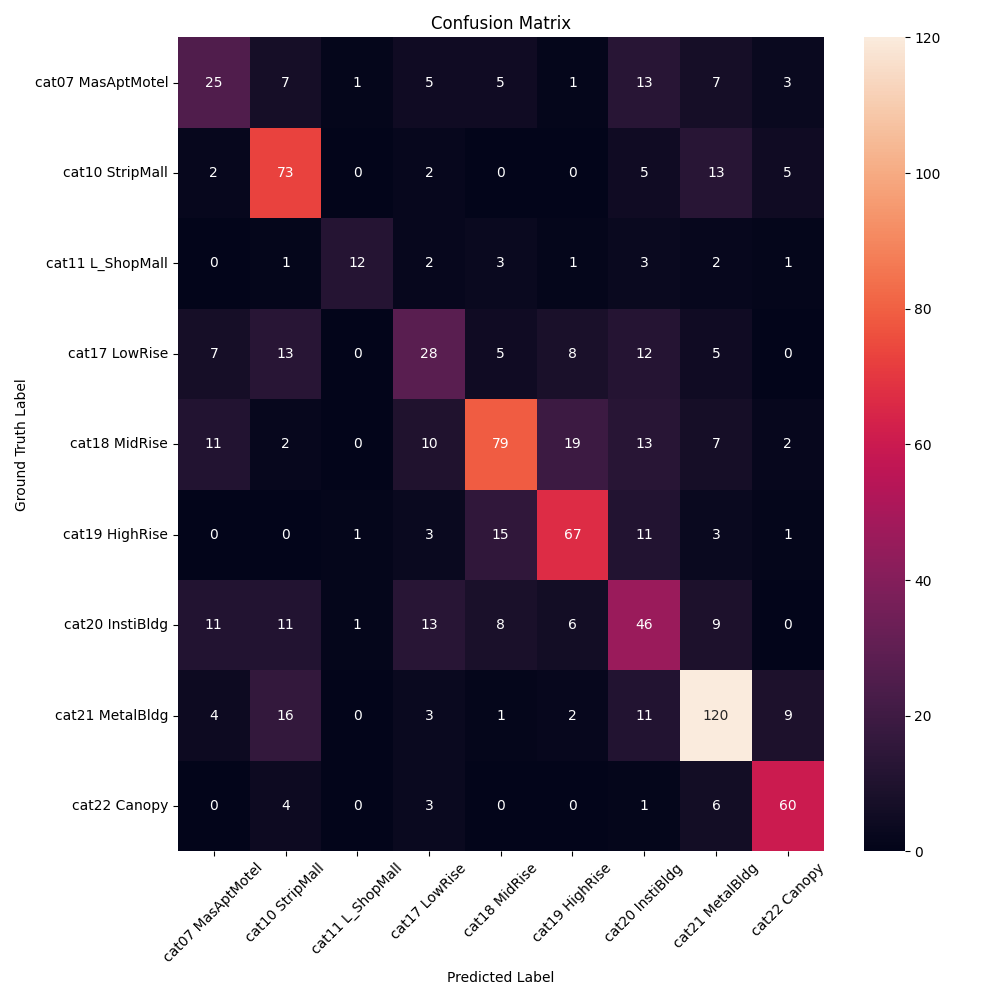

# Bob The Builder (BTB), a building classifier model
## 1. Dataset Overview
The dataset is a subset of images of various building types.

| Dataset | Number of Images | Class Distribution |
|---------|------------------|--------------------|
| Training | 5591 | {'cat07 MasAptMotel': 412, 'cat10 StripMall': 717, 'cat11 L_ShopMall': 156, 'cat17 LowRise': 556, 'cat18 MidRise': 900, 'cat19 HighRise': 629, 'cat20 InstiBldg': 657, 'cat21 MetalBldg': 1021, 'cat22 Canopy': 543} |
| Validation | 859 | {'cat07 MasAptMotel': 67, 'cat10 StripMall': 100, 'cat11 L_ShopMall': 25, 'cat17 LowRise': 78, 'cat18 MidRise': 143, 'cat19 HighRise': 101, 'cat20 InstiBldg': 105, 'cat21 MetalBldg': 166, 'cat22 Canopy': 74} |

### 1.1 Training Class Distribution

  

### 1.2 Validation Class Distribution

  

## 2. Model Training
- ### 2.1 Baseline model
file: [train_cnn_baseline.py](src/train_cnn_baseline.py)

The Baseline model is a simple Convolutional Neural Network (CNN) with three convolutional layers followed by fully connected layers for classification. 
  - Feature Extraction
    - Conv1: 3 → 64 channels, kernel=3x3, padding=1, MaxPool2x2
    - Conv2: 64 → 128 channels, kernel=3x3, padding=1, MaxPool2x2
    - Conv3: 128 → 256 channels, kernel=3x3, padding=1, MaxPool2x2
  - Classification:
    - Flattened output (256x28x28) ->  FC1: 512 units -> ReLU -> Dropout()
    - Fully connected layer: num_classes units 
  <!-- - Confusion Matrix
    

    
Click to view confusion matrix (9 classes)

    

      
    

    

    

    
Click to view confusion matrix (6 classes)

    

      
    

    
 -->

- ### 2.2 Bob The Builder 
  - file: [train_btb__.py](src/train_btb__.py)
  - As a visual backbone we used frozen Vision Transformer (ViT) - [vit-base-patch16-224](https://huggingface.co/google/vit-base-patch16-224)
  - We trained the last 5 transformer blocks of the pretrained vit-base-patch16-224 model.
  - The vit-base-patch16-224 model was pre-trained on ImageNet-21k (14M images, 21k classes) and further fine-tuned on ImageNet-1k (1.3M images, 1k classes).

  - Feature Extraction:
    - Patch Embedding: 16x16 patches, 768 embedding dimension
      - Transformer Encoder: 12 layers, 12 heads, 3072 MLP dimension
      - Frozen Weights: First 7 transformer blocks (layers 1-7) ❄️
      - Fine-tuned Weights: Last 5 transformer blocks (layers 8-12) 🔥

  - Classification:
    - MLP Head: 768 → 9 (number of classes in our dataset)

  <!-- - Confusion Matrix for 6 Classes (after removing low accuracy classes)
    

    
Click to view confusion matrix (9 classes)

    

      
    

    

    

    
Click to view confusion matrix (6 classes)

    

      
    

    
 -->

## 3. Evaluation Results
checkpoints: [gdrive](https://drive.google.com/drive/folders/11MH0oRZFibajfO2Mm-OSSgZ3lJC0f8bs?usp=sharing)
<!-- Confusion matrices for different epochs of the baseline and finetuned ViT models can be found in the [figures](figures) folder. -->
### 3.1 Model Performance Analysis (Baseline CNN vs Bob The Builder)
**Our proposed Bob The Builder (BTB) achieves 94.25% validation accuracy for 6 classes and 82.31% validation accuracy for 9 classes.**
<table>
  <tr>
    <th colspan="2">Model Details</th>
    <th>Epoch</th>
    <th colspan="4">Performance Metrics (Building Classification Validation set)</th>
  </tr>
  <tr>
    <td><b>Architecture</b></td>
    <td><b>Configuration</b></td>
    <td><b>Epoch</b></td>
    <td><b>Accuracy (%)</b></td>
    <td><b>Precision (%)</b></td>
    <td><b>Recall (%)</b></td>
    <td><b>F1 Score</b></td>
  </tr>
  <tr>
    <td rowspan="2">Baseline CNN</td>
    <td>9 classes</td>
    <td>50 </td>
    <td>65.66 (-- %)</td>
    <td>67 (-- %)</td>
    <td>63 (-- %)</td>
    <td>64 (-- %)</td>
  </tr>
  <tr>
    <td>6 classes*</td>
    <td>50</td>
    <td>79.80(--%)</td>
    <td>79 (--%)</td>
    <td>76 (--%)</td>
    <td>77 (--%)</td>
  </tr>
  <tr>
    <td rowspan="2">Bob The Builder</td>
    <td>9 classes</td>
    <td>20 </td>
    <td><b>82.31 (+25.36%) </b></td>
    <td><b>82 (+22.39%) </b></td>
    <td><b>82 (+30.16%)</b></td>
    <td><b>82 (28.13%) </b></td>
  </tr>
  <tr>
    <td>6 classes*</td>
    <td>20</td>
    <td><b>94.25 (+18.11%)</b></td>
    <td><b>94 (+18.99%)</b></td>
    <td><b>94 (+23.68+%)</b></td>
    <td><b>94 (+22.07%)</b></td>
  </tr>
</table>
*6 classes: Excluding categories 7 (MasAptMotel), 17 (LowRise), and 20 (InstiBldg) due to low accuracy

### 3.2 Training- Validation loss and accuracy curve of Bob The Builder
The model shows steadily decreaseing training and validation loss over epochs while maintaining a very small gap. This suggests that the model is not overfitting and is generalizing well to the validation set. The validation accuracy is outperforming the training accuracy which is also indicating that the model is generalizing well to the validation set.
- #### For 9 Classes (Epoch 20)
  

  
- #### For 6 Classes (Epoch 20)
  

  

### 3.3 Confusion Matrix Analysis of Bob The Builder
The model is good at recognizing ``MetalBldg`` structures but struggles to differentiate similar types of buildings like ``LowRise`` and ``MidRise``
- #### For 9 Classes (Epoch 20)
  

  

### 3.4 Comparison with state of the arts
The table shows that Bob The Builder significantly outperforms heavily pre-trained Large Visual Language Models: CLIP and BLIP2 in terms of accuracy, precision, recall, and F1 score for both 9 and 6 classes. Notably, Bob The Builder achieves an impressive 94.25% accuracy for 6 classes, compared to CLIP's 38.42% and BLIP2's 19.22%.
<table>
  <tr>
    <th colspan="2">Model Details</th>
    <th>Epoch</th>
    <th colspan="4">Performance Metrics (Building Classification Validation set)</th>
  </tr>
  <tr>
    <td><b>Architecture</b></td>
    <td><b>Configuration</b></td>
    <td><b>Epoch</b></td>
    <td><b>Accuracy (%)</b></td>
    <td><b>Precision (%)</b></td>
    <td><b>Recall (%)</b></td>
    <td><b>F1 Score</b></td>
  </tr>
  <tr style="background-color: cyan; color: black;">
    <td rowspan="2">Bob The Builder</td>
    <td>9 classes</td>
    <td>20</td>
    <td><b>82.31</b></td>
    <td><b>82</b></td>
    <td><b>82</b></td>
    <td><b>82</b></td>
  </tr>
  <tr style="background-color: lightorange;">
    <td>6 classes*</td>
    <td>20</td>
    <td><b>94.25</b></td>
    <td><b>94</b></td>
    <td><b>94</b></td>
    <td><b>94</b></td>
  </tr>
  <tr style="background-color: cyan; color: black;">
    <td rowspan="2">CLIP (ViT Large Patch 14)</td>
    <td>9 classes</td>
    <td>0 (zero-shot)</td>
    <td>29.22</td>
    <td>30</td>
    <td>33</td>
    <td>25</td>
  </tr>
  <tr style="background-color: lightorange;">
    <td>6 classes*</td>
    <td>0 (zero-shot)</td>
    <td>38.42</td>
    <td>38</td>
    <td>43</td>
    <td>36</td>
  </tr>
  <tr style="background-color: cyan; color: black;">
    <td rowspan="2">BLIP2 (blip2-opt-2.7b)</td>
    <td>9 classes</td>
    <td>0 (zero-shot)</td>
    <td>9.54</td>
    <td>1</td>
    <td>11</td>
    <td>2</td>
  </tr>
  <tr style="background-color: lightorange;">
    <td>6 classes*</td>
    <td>0 (zero-shot)</td>
    <td>19.22</td>
    <td>3</td>
    <td>17</td>
    <td>5</td>
  </tr>
</table>
*6 classes: Excluding categories 7 (MasAptMotel), 17 (LowRise), and 20 (InstiBldg) due to low accuracy

## 4. HPRC Usage
We utilized HPRC resources to train our model and infer pre-trained large visual language models. The example SLURM script used: [hprc.sh](src/hprc.sh)

## 5. Recommendation or Possible Proposal for Research Direction

- Dataset Related: 
  -  Low distribution classes and overlapping characteristics classes (LowRise and MidRise) can be further investigated to improve the model's performance.
- Archtecture Related
  - For overlapping classes like LowRise and MidRise, Directed Acyclic Graph based hierarchical classification model can be explored to improve the model's performance.
  - Different visual backbone can be explored: 
    - Swin Transformer
    - CNN+Transformer hybrid models: ConvNeXt
    - EfficientNetV2 which offers faster training and better performance
- Performance Optimization related: 
  - Model compression and quantization can be explored to make the model run on drone or edge devices. 
